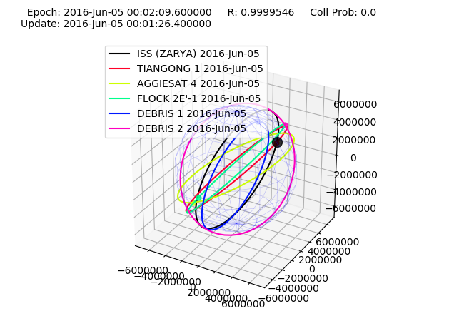

# Satellite Collision Avoidance


## Motivation

Since 2004 the amount of space launchings has been gradually increased. Currently, there are more than 100 satellites launched into space every year. This number could be expanded rapidly due to such projects as providing global internet by Starlink. The increased amount of objects in space leads to a higher probability of their collision.

Every case of collision is currently processed manually. In this project, we investigate methods of **reinforcement learning** to create a system for **automatic maneuver estimation** in order to prevent collisions.

||
|:--:| 
|Space debris reconstrucion from [Stuffin Space project](http://stuffin.space)|

## What is this project about?

Here I will pass the short project description with scheme's.

## Installation
<!-- 
For installation you need python 3 and . -->

### Step 1

To set up the project first copy the repo to your local machine:

``` 
git clone https://github.com/yandexdataschool/satellite-collision-avoidance.git
```

### Step 2

After cloning the repo, install **requirements**:

```
 pip install -r requirements.txt
```

We use following libraries:
> * Pykep
> * Pandas
> * Matplotlib
> * Numpy
> * Scipy

### Run Examples

Now you can run examples of space simulator.

Run following code:
```
python example1.py
```

If evereything is correct, you should get such plot:



And output:
```
Simulation ended.
Collision probability: 0.0.
Reward: 0.9999546000702375.
```

Here I will provide more demo, including one of RL method example (learning and running).

## API
Here will be described all usage scenarios with code examples. 

## Method Descriptions
Here will be described main methods of the project. I suggest to create for any new RL method a new .md file in different folder, and get there fulldescription of what was done, which results  we have.

## Authors

* **Nikita Kazeev** - scientific director, Yandex LAMBDA Factory
* **Irina Ponomareva** - scientific advisor, TSNIIMASH
* **Leonid Gremyachi** - MSc in computer science, NRU-HSE, 1st year.
* **Dubov Dmitry** - BSc in computer science, NRU-HSE, 4th year.

<!-- See also the list of [contributors](https://github.com/your/project/contributors) who participated in this project.
 -->
## License

This project is licensed under the TSNIIMASH and LAMBDA Factory. (?)

<!-- ## Acknowledgments

* Hat tip to anyone who's code was used
* Inspiration
* etc -->

## Useful links

* For space simulation and calculations we use **pykep** library. [[Pykep](https://esa.github.io/pykep/)]
* http://stuffin.space/
* other links ...
