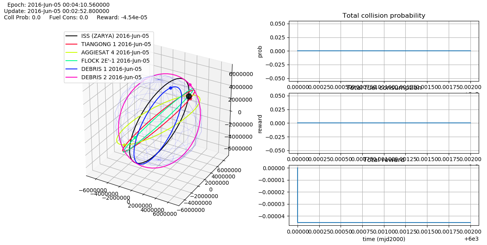

# Satellite Collision Avoidance


## Motivation

Since 2004 the number of space launches has been gradually increasing. Currently, there are more than 100 satellites launched into space every year. This number could grow rapidly due to such projects as the constellation providing worldwide internet access internet by OneWeb. The increasing amount of objects in space leads to a higher probability of their collision.

Most conjunction events are currently processed manually. In this project, we employ state-of-the-art **reinforcement learning** methods to create a system for **automatic maneuver optimization** in order to avoid collisions.

||
|:--:| 
|Space debris reconstrucion from [Stuffin Space project](http://stuffin.space)|

## Flow overview


**1** and **2**: Space objects are monitored by ROSCOSMOS <br />
**3**: ROSCOSMOS computes conjunction events <br /> 
**4**: Space Navigator gets data from ROSCOSMOS <br />
**5**: Environment is solved with RL <br />
**6**: Space Navigator returns optimal collision avoidance maneuver <br />

## Installation

### Step 1

To set up the project first copy the repo to your local machine:

``` 
git clone https://github.com/yandexdataschool/satellite-collision-avoidance.git
```

### Step 2

After cloning the repo, install **requirements**:

```
 pip install -r requirements.txt
```

We use **Python 3.6.5** and following libraries:
> * Pykep
> * Pandas
> * Matplotlib
> * Numpy
> * Scipy
> * Torch
> * tqdm

If you have any problems with Pykep installation, you could try [this](https://esa.github.io/pykep/documentation/index.html) or use the virtual environment in current repo (which already has Pykep package):
```
mv env_with_pykep env
source env/bin/activate
pip install -r requirements.txt
```

P.S. Don't forget to disactivate virtual environment after all:
```
disactivate
```

### Step 3

Install the package:
```
python setup.py install
```

or use for development:
```
python setup.py develop
```

### Run Examples

Now you can run examples of space simulator.

#### Example 1: test fight

Run following code:
```
python examples/test_flight.py -p true
```

If evereything is correct, you should get such plot:



And output:
```
Start time: 6000.0   End time: 6000.01   Simulation step:1e-06

...
Space objects description
...

Simulation ended in 4.7806 sec.

Collision probability: 0.0
Fuel consumption: 0.0            
Trajectory deviation coefficient: 0.0

Reward components:
Coll Prob R: -0.0     Fuel Cons R: -0.0     Traj Dev coef R: -0.0            
Total Reward: -0
```

#### Example 2: maneuvers for random generated collision situation

Run following code to generate collision situation environment with 5 dangerous debris objects in the time interval from 6601 to 6602 ([mjd2000](http://www.solarsystemlab.com/faq.html)) and save it to data/environments/generated_collision_5_debr.env:
```
python generation/generate_collision.py \
-n_d 5 -start 6601 -end 6602 -save_path data/environments/generated_collision_5_debr.env
```

Then, to calculate the maneuvers using the Cross Entropy method and save them to training/agents_tables/CE/action_table_CE_for_generated_collision_5_debr.csv, run:
```
python training/CE/CE_train_for_collision.py \
-env data/environments/generated_collision_5_debr.env -print true -progress true \
-save_path training/agents_tables/CE/action_table_CE_for_generated_collision_5_debr.csv
```

Finally, to run the simulator for generated environment and obtained maneuvers:
```
python  examples/collision.py -env data/environments/generated_collision_5_debr.env \
-model training/agents_tables/CE/action_table_CE_for_generated_collision_5_debr.csv
```


## Running the tests

Currently there are only tests for api module. Run it with command:
```
python tests/test_api.py
```

## Documentation and tutorials

Tutorial on environment setup and simulator:
* [Simulator](examples/Notebooks/Simulator_tutorial.ipynb)

Tutorial on learning an agent: 
* [MCTC](examples/Notebooks/MCTS_tutorial.ipynb)
* [CE](examples/Notebooks/CE_tutorial.ipynb)

## RL Methods description

1. [MCTS](space_navigator/models/MCTS/MCTS.md)
2. [CE](space_navigator/models/CE/CE.md)

<!-- ## Authors

* **Nikita Kazeev** - scientific director, Yandex LAMBDA Factory
* **Irina Ponomareva** - scientific advisor, TSNIIMASH
* **Leonid Gremyachikh** - MSc in computer science, NRU-HSE, 2st year.
* **Dubov Dmitry** - BSc in computer science, NRU-HSE, 4th year. -->

<!-- See also the list of [contributors](https://github.com/your/project/contributors) who participated in this project.
 -->

<!-- ## License

This project is licensed under the TSNIIMASH and LAMBDA Factory. (?)
 -->

<!-- ## Acknowledgments

* Hat tip to anyone who's code was used
* Inspiration
* etc -->

## Useful links

* For space simulation and calculations we use **pykep** library. [[Pykep](https://esa.github.io/pykep/)]
* http://stuffin.space/
